# 04 — How Flatcar works at runtime: partitions, A/B updates, state and boot

This is the mechanism document. It explains what is on the disk, why there are two copies of the OS, how an update is
written, activated and, if necessary, undone, what is writable and where state lives, and what happens between power-on
and your first systemd unit. Where the official documentation and the build files disagree, I say so and follow the
build files, because they are what produces your nodes.

## The disk layout and why it looks like this

The partition table is documented as having nine slots and being inspired by Chromium OS's. The build's
`disk_layout.json` gives the concrete sizes and filesystems for the base layout (512-byte blocks):

| # | Label | Size (base layout) | Filesystem | Purpose |
|---|---|---|---|---|
| 1 | EFI-SYSTEM | 1 GiB | vfat, mounted at `/boot` | GRUB and, for each slot, the kernel and initrd (`flatcar/vmlinuz-a`, `-b`) |
| 2 | BIOS-BOOT | 2 MiB | none | GRUB stage for legacy BIOS boots |
| 3 | USR-A | 2 GiB | btrfs, zstd-compressed, dm-verity protected, mounted read-only at `/usr` | One copy of the OS |
| 4 | USR-B | 2 GiB | empty in a fresh image | The other copy of the OS |
| 5 | ROOT-C | none | none | Reserved |
| 6 | OEM | 1 GiB | btrfs, zlib-compressed, mounted at `/oem` | Platform-specific material (also visible as `/usr/share/oem`) |
| 7 | OEM-CONFIG | 64 MiB | none | Optional OEM storage |
| 8 | (reserved) | none | none | Reserved |
| 9 | ROOT | VM layout: about 6 GiB, grown at first boot | ext4, mounted at `/` | All mutable state |

> ⚠️ Verify: the public disk-layout page lists USR as "EXT2" and ROOT as "EXT4, BTRFS, or XFS". The build's layout file
> says USR is btrfs with zstd compression and ROOT is ext4, and the update documentation separately mentions "the new
> compressed btrfs `/usr` partition". I follow the build file. Confirm with `findmnt /usr /` on a node.

Two design choices explain most of the rest. First, `/usr` is a separate partition rather than a subtree of one root
filesystem, which is what makes it possible to replace the OS wholesale without touching state. The disk-layout page puts
it plainly: "The data stored on the root partition isn't manipulated by the update process." Second, ROOT is the last
partition in the table, which is why on first boot Ignition can grow it to fill whatever disk size the platform gave you
without moving anything.

Look at what `/usr` actually is at runtime. It is not a mount of `/dev/vda3`. The kernel command line carries a
dm-verity root hash, the initrd sets up a verity device over the chosen USR partition, and that device is mounted at
`/usr` read-only (`mount.usrflags=ro` on the kernel command line; `rootflags=rw` for ROOT). In a lab you can see it with
`rootdev -s /usr`, `mount | grep -w /usr`, `dmsetup status` and `veritysetup status usr`, as the project's learning
series walks through ([learning series][learning-series]). dm-verity verifies blocks against the hash tree as they are
read, so the partition is read-only by construction and tamper-evident rather than merely mounted read-only.

## A/B updates: what the two copies are for

The A/B scheme is borrowed from ChromeOS. At any time one USR partition is the running OS and the other is a staging area.
Three GPT attributes on each USR partition drive everything: `priority`, `tries` and `successful`, implemented by a
GRUB patch (`gptprio`) and read or written with `cgpt` ([disk layout][disk-layout], [manual rollbacks][rollbacks]).
GRUB's configuration selects the slot by calling `gptprio.next`, and sets `fallback="0 0 0"`, so if the chosen entry
fails to boot, GRUB tries the previous one ([grub.cfg][grub-cfg]).

### The update, step by step

`update_engine` is a client for the Omaha update protocol. It identifies itself with an application ID, the OS version and
a "track" (the channel group), and asks the update server whether a newer version exists; the PXE stub in the
`update_engine` repository shows the request shape ([stub][ue-stub]). Machines check in roughly ten minutes after boot and
about hourly after that ([update strategies][update-strategies]). When the server answers with a payload, the client
downloads the full `/usr` image, writes it to the inactive partition, verifies it against the baked-in public key, then
runs the post-install script (`flatcar-postinst`).

The post-install does the work that makes the next boot consistent. It calls an optional OEM hook at
`/usr/share/oem/bin/oem-postinst` with the slot letter and the mount point of the new `/usr`; it downloads the OEM and
extension payloads that belong to the new version (using the new image's own `download_sysext` and the same payload key);
and it handles proxy variables for the download ([postinst][ue-postinst]). Then it marks the new slot with one try and the
highest priority (`cgpt add -S0 -T1` then `cgpt prioritize`) and creates `/run/reboot-required`, the Ubuntu-style flag
file that kured watches for. After a successful update the GPT shows what the documentation's walkthrough shows: the old slot at
`priority=1 tries=0 successful=1`, the new slot at `priority=2 tries=1 successful=0`
([manual rollbacks][rollbacks]).

The client now reports `UPDATE_STATUS_UPDATED_NEED_REBOOT` and stops. It does not reboot the machine. That is the
design: the OS can be staged continuously, but *when* a node goes down is a separate decision, made by a reboot manager
(locksmithd by default, the Flatcar Linux Update Operator or kured in Kubernetes, or you). Doc 07 is about that decision.

### The first boot into the new version, and rollback

On the reboot GRUB picks the higher-priority slot and decrements its `tries`. If the new OS boots, `update_engine` starts,
and once it has been up for a short time (the documentation says "around two minutes" in one place and "about 1 minute" in
another) it runs `flatcar-setgoodroot`, which is three lines of effect: it repairs the GPT if needed, sets `successful=1`
and `tries=0` on the running `/usr` device, and re-asserts its priority ([setgoodroot][ue-setgoodroot]). If the OS never
gets that far, because of a kernel panic, a failed initrd, or a reboot loop, `tries` is exhausted and GRUB falls back to
the previous slot automatically.

That success criterion is deliberately weak: "update_engine started and stayed up." The documentation's suggestion for
strengthening it is to make `update-engine.service` depend on your critical units, so the slot is only marked good when
they are healthy, and the project's learning series builds a complete pattern for this that applies the gate only on the
first boot after an update, so you do not create reboot loops in normal operation ([manual rollbacks][rollbacks],
[learning series][learning-series]). Lab 02 implements that pattern.

```mermaid
stateDiagram-v2
    [*] --> RunningA: slot A priority=1 tries=0 successful=1
    RunningA --> Checking: update-engine poll (about hourly)
    Checking --> RunningA: no update (IDLE)
    Checking --> Downloading: Omaha response with payload
    Downloading --> Verifying: full /usr partition image written to slot B
    Verifying --> Finalizing: signature checked against baked-in key
    Finalizing --> NeedReboot: postinst: OEM hook, extension payloads, then B priority=2 tries=1 successful=0
    NeedReboot --> Rebooting: reboot manager decides (locksmithd, FLUO, kured, you)
    Rebooting --> TryB: GRUB gptprio.next picks B, tries drops to 0
    TryB --> GoodB: update-engine stays up (docs say 1-2 minutes), flatcar-setgoodroot sets successful=1
    GoodB --> [*]: B is now the running slot, A is the rollback target
    TryB --> FallbackA: B never marks success (kernel panic, critical unit dependency fails, reboot loop)
    FallbackA --> RunningA: GRUB fallback to previous entry; B stays successful=0 tries=0
    GoodB --> ManualRollback: cgpt prioritize passive slot, reboot
    ManualRollback --> RunningA
```

Manual rollback is the same mechanism run by hand. `cgpt find -t flatcar-usr` lists the USR partitions, `rootdev -s /usr`
tells you which one is running, and `cgpt prioritize <passive partition>` makes the other one win on the next boot;
if that partition was never successfully booted you also reset `tries` with `cgpt add -T 1`. There is no way to
downgrade to an arbitrary version through the normal update path; the documented alternatives are `flatcar-update --to-version`
(which installs a chosen version into the inactive slot, optionally disabling further updates) and a channel downgrade by
rewriting the release version file, which the project says it does not recommend ([manual rollbacks][rollbacks]).

### Gotchas that follow from the mechanism

- **Masking `update-engine` can strand an update.** If you mask it, then unmask it to take an update and mask it again before it has run long enough to mark the new slot successful, the slot never gets `successful=1` and the next reboot falls back to the old version. The docs' advice is to set `SERVER=disabled` in `/etc/flatcar/update.conf` instead of masking, and to check `cgpt show "$(rootdev -s /usr)" | grep successful=1` before masking again ([update strategies][update-strategies]).
- **One staged update at a time.** In `UPDATE_STATUS_UPDATED_NEED_REBOOT` the client will not stage a newer version. The documented workaround is `update_engine_client -reset_status` followed by `-check_for_update` (the "double update workaround"). Note that `-reset_status` is not cosmetic: it prints the `cgpt` command needed "to undo partition table changes", which tells you it discards the staged slot's boot priority.
- **Very old nodes may not be able to update directly.** The documentation lists two cases: certificates too old to reach the update server, and old versions that cannot handle the compressed btrfs `/usr`; the recommended path is to go through the LTS 2023 stream (major 3510) first.
- **The release feed matters for rollback targets.** Rolling back to a specific version requires that payload to be available from your update source (doc 07).

## What is writable, and where state lives

Everything outside `/usr` lives on ROOT, on the same disk, and survives updates. Practically:

- `/etc` is where your configuration lands. How it is composed changed recently (see below).
- `/var` holds container images and state (`/var/lib/containerd`, `/var/lib/docker`), logs and the Kubernetes kubelet's data. The base layout links `/usr/libexec/kubernetes/kubelet-plugins/volume/exec` to `/var/kubernetes/kubelet-plugins/volume/exec` so that components expecting to write under `/usr/libexec` end up in writable space ([baselayout ebuild][baselayout]).
- `/opt` is the conventional place for software you add. The sysext documentation says the earlier recommendation was to put binaries in `/opt/bin` and prefer them in `PATH`; note that `/opt/bin` is not added to the default `PATH` of systemd units, which is why the official Kubernetes example sets `Environment="PATH=...:/opt/bin"` in its units ([sysext][sysext-doc], [Kubernetes][k8s-doc]).
- `/oem` (also `/usr/share/oem`) is the OEM partition, mounted separately.
- `/home` is on ROOT; the `core` user is the default login.

> ⚠️ Verify: I did not establish whether `/usr/local` is writable on Flatcar. RKE2's installer probes this at run time
> (doc 10), so check on a node (`touch /usr/local/x`) rather than assuming.

### `/etc` is two different mechanisms depending on your release

Before the change, Flatcar mounted a custom overlayfs on `/etc` with defaults from `/usr/share/flatcar/etc`. The update
documentation describes the consequence from Alpha 3535.0.0: unmodified files in `/etc` are updated through the overlay,
because files identical to the shipped default are deleted on boot so new defaults propagate, with
`/etc/.no-dup-update` as the opt-out, and `git diff --no-index /usr/share/flatcar/etc /etc` shows how your node differs
([update strategies][update-strategies]).

A December 2025 changelog entry then records a switch: "`/etc/` from a custom overlayfs for A/B updates to using a
systemd-confext extension providing the default contents by using systemd-confext in the mutable mode where `/etc/` gets
used as upperdir", plus moving sysext mounting into the initrd and dropping the `ensure-sysext.service` workaround
([changelog][confext]). In the release data this first appears in Alpha 4628.0.0 and is present in Stable 4757.2.0,
but not in Stable 4593.2.5 or LTS 4081.x. Both mechanisms present the same user-visible contract (you write to `/etc`; defaults
come from the image and update with it), but their internals, and therefore some debugging commands, differ.
Lab 02 updates across exactly this boundary, so you can see both.

> ⚠️ Verify: the diff and unmount commands in the update documentation (`unshare -m sh -c "umount /etc; ls -lahR /etc"`)
> describe the overlay implementation. Check what works on the release you run before putting them in a runbook.

## Boot, from power-on to your units

The following diagram is derived from `grub.cfg`, the bootengine dracut modules and the project's boot-process
document. The Flatcar-specific kernel arguments are `flatcar.first_boot` and `flatcar.oem.id`; they are not the
`ignition.firstboot` argument documented in upstream Ignition.

```mermaid
flowchart TD
    fw["Firmware: UEFI (or BIOS + GRUB stub)"] --> grub["GRUB reads grub.cfg from EFI-SYSTEM"]
    grub --> oemcfg{"secure_boot == 0 and<br/>OEM partition has grub.cfg?"}
    oemcfg -- yes --> srcoem["source OEM grub.cfg<br/>(sets oem_id, linux_append, ...)"]
    oemcfg -- no --> fb
    srcoem --> fb{"EFI-SYSTEM has<br/>flatcar/first_boot<br/>(or coreos/first_boot)?"}
    fb -- yes --> fbset["add kernel arg<br/>flatcar.first_boot=detected"]
    fb -- no --> sel
    fbset --> sel["gptprio.next picks USR-A or USR-B<br/>from priority / tries / successful"]
    sel --> kern["load /flatcar/vmlinuz-a or -b + initrd<br/>cmdline: mount.usrflags=ro root=LABEL=ROOT<br/>+ usr=PARTUUID=... + verity hash"]
    kern --> initrd["initramfs (dracut + bootengine)"]
    initrd --> usr["set up dm-verity device, mount USR at /sysusr<br/>(tools too big for the initrd run from there)"]
    usr --> first{"flatcar.first_boot set?"}
    first -- no --> pivot
    first -- yes --> net["start networkd (DHCP) so Ignition can fetch remote config"]
    net --> ign["Ignition: read flatcar.oem.id, fetch OEM + user config"]
    ign --> disks["Ignition: disks, partitions, filesystems<br/>(ROOT resized to fill disk)"]
    disks --> tmp["systemd-tmpfiles populates the root FS"]
    tmp --> files["Ignition: users, files, links, units"]
    files --> rm["delete flatcar/first_boot from EFI-SYSTEM"]
    rm --> setup["initrd-setup-root-after-ignition:<br/>OEM sysext links, enabled-sysext.conf downloads,<br/>confext + sysext merge"]
    setup --> pivot["pivot root into ROOT, systemd starts"]
    pivot --> ue["update-engine starts; after it has run 1-2 minutes<br/>(docs state both) flatcar-setgoodroot marks the slot successful"]
```

Read the diagram with these points in mind.

GRUB decides three things. It chooses the USR slot with `gptprio`. It checks the EFI System Partition for
`flatcar/first_boot` (or the legacy `coreos/first_boot`) and, if found, adds `flatcar.first_boot=detected`. And it loads the OEM
partition's `grub.cfg` for platform settings, but only when `secure_boot` is `0`; with Secure Boot the OEM file is not
sourced ([grub.cfg][grub-cfg]). GRUB also looks for an initial disk GUID and sets `flatcar.randomize_guid`, so that disks
cloned from an image get unique GUIDs.

The initrd then does everything that must happen before the real root is used. It mounts ROOT, randomizes the disk GUID if
asked, and, only when `flatcar.first_boot` is set, brings up networkd with DHCP so Ignition can fetch remote resources,
then runs Ignition ([boot process][boot-process]). Ignition's own tools are too large for the initrd, so they run from the
`/sysusr` mount of the chosen USR partition. This is why a node that cannot reach a remote resource in its Ignition config
will fail to boot rather than come up half-configured: Ignition's design is to "produce the machine specified or no machine
at all" ([rationale][rationale]).

After Ignition the initrd runs `initrd-setup-root-after-ignition`, which is where Flatcar's extension model attaches. It
links the active OEM system extension, then reads `enabled-sysext.conf` from `/etc/flatcar` and `/usr/share/flatcar`,
and for each named official extension stores the image at `/etc/flatcar/sysext/flatcar-NAME-VERSION.raw` and symlinks it
from `/etc/extensions/`. If the image is not already there, the initrd starts networking and downloads it from the
release file server, and **if that download fails the boot fails** ([bootengine][bootengine-setup]). Finally it refreshes
confext and merges sysext inside the initrd. A failure to merge sysext is logged and boot continues. Doc 06 builds on this.

> ⚠️ Verify: the initrd extension logic above is read from `flatcar/bootengine` at the commit in `VERSIONS.md`, which is
> newer than LTS 4081.x. On LTS, extension merging happens later in boot through `ensure-sysext.service`.

Then systemd takes over from the real root. Units and drop-ins that Ignition wrote are now active, and `update-engine`
starts. Re-running provisioning on an existing node is supported through `flatcar-reset`, which cleans selected state
and triggers Ignition again on the next boot, optionally preserving paths such as `/etc/ssh/ssh_host_.*`, `/var/log` or
`/var/lib/containerd`, and optionally the machine ID ([boot process][boot-process]). It is the closest thing Flatcar has to
"reconfigure", and it is a reset.

## Key takeaways

- The OS is two interchangeable 2 GiB USR partitions (btrfs, dm-verity, read-only at `/usr`); everything mutable lives on ROOT and is untouched by updates.
- An update writes a full `/usr` image to the passive slot and activates it with GPT priority and a single boot attempt; `update_engine` never reboots the node itself.
- A new slot becomes "good" only when `update-engine` has stayed up for a short time; gate it on your critical units if you want rollback to mean something.
- `/etc` is composed differently before and after Alpha 4628 / Stable 4757: an overlayfs in older releases, a mutable systemd-confext in newer ones.
- Ignition runs in the initrd only when `flatcar.first_boot` is set; the same initrd stage wires up sysexts, and an unreachable official extension download fails the boot.

## Sources

- Disk layout and partition table: [`devguide/sdk-disk-partitions.md`][disk-layout]; build layout [`build_library/disk_layout.json`][disk-json]
- GRUB logic: [`build_library/grub.cfg`][grub-cfg]
- Boot process and `flatcar-reset`: [`fb-provision/ignition/boot-process.md`][boot-process]
- Manual rollbacks, GPT attribute walkthrough: [`diagnostics/manual-rollbacks.md`][rollbacks]
- Update and reboot strategies: [`updates-releases/releases/update-strategies.md`][update-strategies]
- `update_engine` post-install and success marking: [`flatcar-postinst`][ue-postinst], [`flatcar-setgoodroot`][ue-setgoodroot], [`update_engine_stub`][ue-stub]
- Initrd extension setup: [`bootengine/dracut/99setup-root/initrd-setup-root-after-ignition`][bootengine-setup]
- `/etc` and sysext change: [`changelog/changes/2025-12-12-default-systemd-confext.md`][confext]
- Learning series (immutability, boot, updates, health-gated rollback): [`getting-started/learning-series/immutability-updates-rollbacks.md`][learning-series]
- Base layout (kubelet plugin directory link): [`baselayout-9999.ebuild`][baselayout]
- Ignition rationale: [`coreos/ignition docs/rationale.md`][rationale]
- Sysext and Kubernetes docs: [`sys-ext/_index.md`][sysext-doc], [`orchestrate/kubernetes/getting-started-with-kubernetes.md`][k8s-doc]

[disk-layout]: https://github.com/flatcar/flatcar-website/blob/415d66a7b79efa4374b927a4cd6d7b5bd1bfeb9c/content/docs/latest/devguide/sdk-disk-partitions.md
[disk-json]: https://github.com/flatcar/scripts/blob/2189f1e166e28c06cdcd1b26fea47f05da78c139/build_library/disk_layout.json
[grub-cfg]: https://github.com/flatcar/scripts/blob/2189f1e166e28c06cdcd1b26fea47f05da78c139/build_library/grub.cfg
[boot-process]: https://github.com/flatcar/flatcar-website/blob/415d66a7b79efa4374b927a4cd6d7b5bd1bfeb9c/content/docs/latest/fb-provision/ignition/boot-process.md
[rollbacks]: https://github.com/flatcar/flatcar-website/blob/415d66a7b79efa4374b927a4cd6d7b5bd1bfeb9c/content/docs/latest/diagnostics/manual-rollbacks.md
[update-strategies]: https://github.com/flatcar/flatcar-website/blob/415d66a7b79efa4374b927a4cd6d7b5bd1bfeb9c/content/docs/latest/updates-releases/releases/update-strategies.md
[ue-postinst]: https://github.com/flatcar/update_engine/blob/f23d6ea848ffe2c8721bc49d2a9f77f4de038ad2/flatcar-postinst
[ue-setgoodroot]: https://github.com/flatcar/update_engine/blob/f23d6ea848ffe2c8721bc49d2a9f77f4de038ad2/flatcar-setgoodroot
[ue-stub]: https://github.com/flatcar/update_engine/blob/f23d6ea848ffe2c8721bc49d2a9f77f4de038ad2/systemd/update_engine_stub
[bootengine-setup]: https://github.com/flatcar/bootengine/blob/7727ec78da72e700e8fa1ce2144cb2476448d186/dracut/99setup-root/initrd-setup-root-after-ignition
[confext]: https://github.com/flatcar/scripts/blob/2189f1e166e28c06cdcd1b26fea47f05da78c139/changelog/changes/2025-12-12-default-systemd-confext.md
[learning-series]: https://github.com/flatcar/flatcar-website/blob/415d66a7b79efa4374b927a4cd6d7b5bd1bfeb9c/content/docs/latest/getting-started/learning-series/immutability-updates-rollbacks.md
[baselayout]: https://github.com/flatcar/scripts/blob/2189f1e166e28c06cdcd1b26fea47f05da78c139/sdk_container/src/third_party/coreos-overlay/sys-apps/baselayout/baselayout-9999.ebuild
[rationale]: https://github.com/coreos/ignition/blob/94173720290741546ffc2cc1a677eb0ab5d0cb84/docs/rationale.md
[sysext-doc]: https://github.com/flatcar/flatcar-website/blob/415d66a7b79efa4374b927a4cd6d7b5bd1bfeb9c/content/docs/latest/sys-ext/_index.md
[k8s-doc]: https://github.com/flatcar/flatcar-website/blob/415d66a7b79efa4374b927a4cd6d7b5bd1bfeb9c/content/docs/latest/orchestrate/kubernetes/getting-started-with-kubernetes.md
