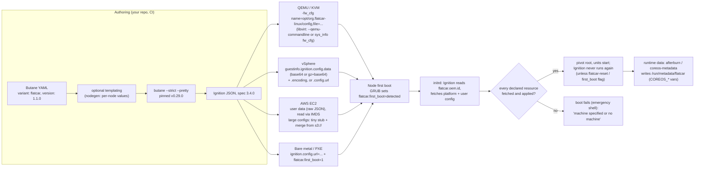

# 05 — Provisioning: Ignition and Butane

Flatcar has no installer script, no post-install package step and no configuration-management agent. A node is created
from an image and a single declarative document, applied once, in the initial RAM disk, before the real system starts.
This document explains why that is the design, what Ignition can and cannot express, how Butane relates to it, and how the
same config reaches a node on KVM, vSphere and AWS. The design rationale is the part that carries over to everything else.

## Why first-boot declarative provisioning instead of cloud-init-style mutation

cloud-init, and its CoreOS-era relative coreos-cloudinit, run inside the booted system, usually on every boot, executing
a mix of declarative keys and scripts against a live, mutable machine. Whatever they do is a mutation of the previous
state, ordering is implicit, a failed step may leave a half-configured machine that still boots, and a re-run may behave
differently from the first run. That is configuration management behavior in a provisioning costume.

Ignition's rationale document states five principles that together reject that model ([rationale][rationale]).

1. **It runs only on first boot.** "Ignition is designed to be used as a provisioning tool, not as a configuration management tool", and modifying a machine means discarding it and re-provisioning.
2. **It produces the machine specified or no machine at all.** "If for any reason Ignition cannot deliver the exact machine that the config asked for, Ignition prevents the machine from booting successfully." A remote file that cannot be fetched is a boot failure, not a warning.
3. **Configs are declarative.** They "describe the state of a system" and do not list steps; "Ignition configs do not allow users to provide arbitrary logic (including scripts for Ignition to run)." Anything imperative must be a systemd service that Ignition creates.
4. **Configs are not meant to be written by hand.** They are "human readable, but difficult to write" on purpose, with only low-level primitives, so you generate them with Butane.
5. **It is distribution-independent.** It offers no package management and nothing distro-specific.

The practical effect for a fleet is that the node's state after first boot is a pure function of the image version and the
config document, which is a thing you can hash, review, diff and archive. If the config is wrong, the node does not boot
and you find out at provisioning time, not weeks later. That is the same "fail early, fail loudly" property you want from
an admission controller, applied to machines.

It also explains what you give up. There is no convergence loop. If you change your config repository, running nodes do not
change. Changes reach a fleet by replacing nodes, or by something you run yourself on top (a DaemonSet, a systemd timer, an
operator). That is a feature of the model, and doc 07 and doc 11 deal with what it means for rollouts.

## What Ignition can and cannot do

Ignition's spec (3.x) covers the primitives needed to lay out a machine, and Butane's Flatcar spec v1.1.0 exposes them
([Butane Flatcar spec][butane-spec]):

- **Storage:** disks and partitions, RAID, filesystems (ext4, btrfs, xfs, vfat, swap), LUKS (including Clevis/TPM2 and Tang), files, directories and links, with ownership, modes, remote sources, compression, per-resource hash verification and HTTP headers.
- **systemd:** unit files, drop-ins, enable, mask, and `contents_local` to keep unit text in separate files.
- **Users:** accounts, groups, SSH authorized keys, password hashes.
- **Kernel arguments:** `kernel_arguments.should_exist` and `should_not_exist` (needs Flatcar 3185 or later per the project docs, and a reboot early in first boot to apply).
- **Config composition:** `ignition.config.merge` and `replace` from `http(s)`, `tftp`, `s3`, `arn`, `gs` and `data:` sources, a custom CA bundle, an HTTP(S) proxy and timeouts for fetching.

It cannot run a script, loop, branch, template a value from the environment, install a package, or manage anything after
first boot. It also cannot write into `/proc`, `/sys`, `/dev`, `/tmp` or `/run`, because those are not mounted when
Ignition runs; the operator notes direct you to sysctl.d, udev rules and tmpfiles.d instead ([operator notes][operator-notes]).
Some behaviors you should know before you rely on them:

- **Remote fetches retry forever.** Over HTTP(S) Ignition waits 10 seconds for response headers per attempt and retries with exponential backoff from 100 ms up to 5 seconds; any non-5xx response completes the request, so a 404 is a hard failure, not a retry ([operator notes][operator-notes]).
- **Filesystem reuse is explicit.** `wipe_filesystem: false` reuses a matching existing filesystem and fails on a mismatch; `true` always wipes. Partitions follow a documented truth table around `should_exist` and `wipe_partition_entry`.
- **Merging is by key.** Child config values override parent values, lists are de-duplicated by their identifying field, and files, directories and links de-duplicate across each other.
- **Enablement depends on presets.** `enabled: true` relies on systemd presets being evaluated for a new machine ID. The boot-process document warns that re-running Ignition on an existing node does not re-evaluate presets, so a re-provision may need the machine ID invalidated or explicit `links` entries ([boot process][boot-process]).

### Secrets

Ignition's operator notes are direct: "We do not recommend storing secrets in Ignition configs", because on many platforms
unprivileged software in the VM, including a container, can read the config from the metadata service. The mitigations they
list are to keep secrets in a child config you merge from a location you control and firewall, and to block the metadata
service from unprivileged workloads. On VirtualBox and VMware, Ignition 2.14.0 and later deletes the config from VM
metadata after successful provisioning (Flatcar ships an `ignition-delete-config.service` for this), which you can prevent
by masking that unit ([operator notes][operator-notes], [init units][init-units]).

This matters for labs 04 and 05: they embed private keys and tokens in Ignition to keep the labs self-contained, and each
lab README says so. In production the right pattern is a short-lived bootstrap token or a node identity that fetches
real secrets from a vault after boot.

## Butane: a transpiler with opinions

Butane reads a YAML "Butane config" with `variant: flatcar` and `version: 1.1.0` and produces Ignition JSON. The Flatcar
v1.1.0 spec "generates Ignition configs with version `3.4.0`", which needs Ignition 2.15.0 or later; the Ignition inside
Stable 4757.2.1 is 2.24.0 and inside LTS 4081.3.10 is 2.19.0, so both accept it (VERSIONS.md). Butane adds three
conveniences worth knowing: `local:` paths resolved against `--files-dir` so large files and units stay in their own files;
`--strict`, which turns warnings, such as an unused or misspelled key, into errors; and validation that the config is
well formed before any machine sees it. New Butane releases are documented as backward compatible, and a Flatcar spec
bump from 1.0.0 to 1.1.0 has no breaking changes, only additions such as LUKS `discard` and `open_options` and S3 access
point ARNs ([Butane upgrading Flatcar configs][butane-upgrading]).

The effect of `--strict` is easy to see with the pinned binary. A misspelled key transpiles without complaint by default; with
`--strict` it fails:

```text
$ printf 'variant: flatcar\nversion: 1.1.0\nstorage:\n  files:\n    - path: /etc/x\n      contnts:\n        inline: a\n' | butane --strict
warning[$.storage.files.0.contnts]:
  --> <stdin>:6:7
 ...
   |       ^^^^^^^^ unused key contnts
Config produced warnings and --strict was specified
```

(That output is from Butane v0.29.0 run during authoring.) Every lab target in this repository transpiles with `--strict`,
and `tools/butanecheck` adds policy checks that Butane does not make: that the spec variant and version match the pins,
that every remote `http(s)` source carries a verification hash, that an enabled unit has an `[Install]` section, that no
private-key material is embedded unless explicitly allowed, and that the transpiled JSON stays under a size budget.

A small Butane config and its real transpiled output (Butane v0.29.0, `--pretty --strict`):

```yaml
variant: flatcar
version: 1.1.0
passwd:
  users:
    - name: core
      ssh_authorized_keys:
        - ssh-ed25519 AAAA...example lab
storage:
  files:
    - path: /etc/hostname
      mode: 0644
      contents:
        inline: demo-node-1
systemd:
  units:
    - name: hello.service
      enabled: true
      contents: |
        [Unit]
        Description=Hello from first boot
        [Service]
        Type=oneshot
        ExecStart=/usr/bin/echo hello
        RemainAfterExit=yes
        [Install]
        WantedBy=multi-user.target
```

```json
{
  "ignition": { "version": "3.4.0" },
  "passwd": { "users": [ { "name": "core", "sshAuthorizedKeys": [ "ssh-ed25519 AAAA...example lab" ] } ] },
  "storage": { "files": [ { "path": "/etc/hostname", "contents": { "compression": "", "source": "data:,demo-node-1" }, "mode": 420 } ] },
  "systemd": { "units": [ { "contents": "[Unit]\nDescription=Hello from first boot\n...", "enabled": true, "name": "hello.service" } ] }
}
```

Note that the file's `inline` content became a `data:` URL in `source`, and the octal mode became decimal `420`. Ignition
is not meant to be read; Butane is.

> ⚠️ Verify: Ignition's rationale says Ignition "also natively accepts Butane YAML configs at boot, transpiling them
> automatically". I did not test that on Flatcar's Ignition build, and Flatcar's documentation always transpiles first.
> Do not rely on it; keep transpilation in your pipeline where `--strict` can gate it.

## Delivery: how the same config reaches a node

Ignition is platform-aware: it reads the `flatcar.oem.id` kernel argument (set by the OEM's `grub.cfg` in the image) to
know where to look for user data, and combines it with provider configuration that does basic setup ([boot process][boot-process]).
The config is identical across platforms; only the transport differs.



### KVM, libvirt and plain QEMU

QEMU delivers the config through the firmware configuration device. Flatcar's own wrapper script builds the argument
`-fw_cfg name=opt/org.flatcar-linux/config,file=<config.ign>` ([wrapper source][qemu-template]). Note the key: upstream
Ignition documents `opt/com.coreos/config`, and Flatcar's scripts and documentation use `opt/org.flatcar-linux/config`.
With libvirt you pass the same argument through `virt-install --qemu-commandline=...` or as a `fw_cfg` entry in the domain
definition; the Flatcar libvirt page notes that `acpi = true` is required with fw_cfg on a q35/OVMF machine
([libvirt][libvirt-doc], [QEMU][qemu-doc]). For PXE-booted or already-booted images the wrapper needs `-append 'flatcar.first_boot=1'`,
and for bare metal the URL goes in the `ignition.config.url` kernel argument alongside `flatcar.first_boot=1`
([iPXE][ipxe-doc]).

### vSphere

On VMware the config goes in the guestinfo property `guestinfo.ignition.config.data`, with
`guestinfo.ignition.config.data.encoding` set to `base64` or `gz+base64` (Ignition's own spec names the encodings `""`,
`base64` and `gzip+base64`; the Flatcar page writes `gz+base64`). Base64 is mandatory on ESXi because "unencoded Ignition
data will lead to Ignition failures during boot due to lack of escaping in the guestinfo XML data". You can instead point
`guestinfo.ignition.config.url` at an HTTP(S) location. Three vSphere-specific constraints follow from the design:

- **Static IP and remote resources.** Ignition relies on DHCP in the initrd to fetch remote resources. From Flatcar major 3248 you can instead supply `guestinfo.afterburn.initrd.network-kargs` to configure networking in the initrd; the old `guestinfo.interface.*` and `guestinfo.dns.*` variables are not supported with Ignition ([VMware][vmware-doc]).
- **Guestinfo set from inside the guest is volatile.** Properties set with `vmtoolsd` are stored in VM process memory and lost on shutdown or reboot, and changing them later needs `touch /boot/flatcar/first_boot` for Ignition to run again.
- **There is no metadata agent by default.** On VMware, "the network setup is defined by you and nothing generic that afterburn would know about", so dynamic values such as the node IP need a custom `coreos-metadata.service` ([VMware][vmware-doc]).

The deployment methods the page documents are OVF template deployment with guestinfo in the wizard and `ovftool` with
`--X:guest:ignition.config.data=...` and `--X:guest:ignition.config.data.encoding=base64`. For a production fleet the
realistic route is clone-from-template or Cluster API, covered in doc 09 and lab 06.

### AWS EC2

On AWS the config is the instance user data, raw Ignition JSON, which Ignition reads from the instance metadata service.
The AWS provider in Ignition fetches `2019-10-01/user-data` and handles IMDSv2 by requesting a session token first
([AWS provider source][ignition-aws]). Cloud SSH keys are handled separately by Afterburn. For anything bigger than the user
data limit, use the merge pattern: put a small stub config in user data whose `ignition.config.merge` points at `s3://bucket/key`,
which Ignition fetches with the instance's IAM role (or anonymously if there is none), so the real config, and any secrets,
sit behind IAM rather than in the metadata service ([operator notes][operator-notes]). Flatcar's AMIs are published per
region and, importantly for pinned autoscaling groups, "AMIs older than 9 months will be un-published" ([AWS][aws-doc]).

> ⚠️ Verify: the EC2 user data size limit (documented by AWS as 16 KB before base64 encoding) is not stated in the
> Flatcar or Ignition sources I read. Check the current AWS limit, and whether the AWS provider accepts gzip-compressed
> user data; the generic gunzip helper exists in the provider utilities but I did not confirm AWS uses it.

### Dynamic data

Some values are not known until the node exists, such as its IP or instance ID. Ignition configs cannot template them,
so Flatcar uses Afterburn (`coreos-metadata.service`), which writes an environment file at `/run/metadata/flatcar` with
`COREOS_*` variable names (the Afterburn docs use `AFTERBURN_*`, and `EC2` and `GCE` replace `AWS` and `GCP`). Your units
declare `After=coreos-metadata.service` and `EnvironmentFile=/run/metadata/flatcar` ([dynamic data][dynamic-data]).

> ⚠️ Verify: the vSphere page's example writes `/run/metadata/coreos` while the dynamic-data page documents
> `/run/metadata/flatcar`. Check the path on a running node (`ls /run/metadata`) before you write a unit that depends on it.

Where per-node values are known at provisioning time, as in labs 04 and 05, the cleaner approach is to render them into
the Butane config before transpiling, which is what `tools/nodegen` does.

## Debugging provisioning

If Ignition fails, the node drops to an emergency shell in the initrd, and `journalctl -u 'ignition*'` shows why. If the
console looks stuck, add `systemd.journald.max_level_console=debug console=ttyS0` to the kernel command line in GRUB. With
no console access, validate the config offline with `ignition-validate`, which, in the project's example, catches a misspelled
key such as `souce` ([boot process][boot-process]). To re-run provisioning on an existing node, use `flatcar-reset` with
`--keep-paths` for the state you want to retain, then reboot.

## Key takeaways

- Ignition runs once, in the initrd, and either produces exactly the machine the config describes or no machine; configuration changes mean new nodes.
- Configs are declarative with no scripting; anything imperative becomes a systemd unit that Ignition writes.
- Always transpile with `butane --strict` in CI; the spec `flatcar` 1.1.0 emits Ignition 3.4.0, which both Stable 4757.2.1 and LTS 4081.3.10 accept.
- Delivery differs by platform (QEMU `fw_cfg` key `opt/org.flatcar-linux/config`, vSphere guestinfo with mandatory base64, AWS user data via IMDS) but the config is identical.
- Treat the Ignition config as readable by workloads on the node unless you block the metadata path; keep real secrets out of it.

## Sources

- Ignition rationale, operator notes, supported platforms: [`rationale.md`][rationale], [`operator-notes.md`][operator-notes], [`supported-platforms.md`][supported-platforms]
- Butane Flatcar v1.1.0 spec and upgrade notes: [`config-flatcar-v1_1.md`][butane-spec], [`upgrading-flatcar.md`][butane-upgrading], [`getting-started.md`][butane-start]
- Flatcar boot process, dynamic data: [`boot-process.md`][boot-process], [`dynamic-data.md`][dynamic-data]
- Platform pages: [QEMU][qemu-doc], [libvirt][libvirt-doc], [VMware][vmware-doc], [AWS EC2][aws-doc], [iPXE][ipxe-doc]
- QEMU wrapper script: [`build_library/qemu_template.sh`][qemu-template]
- Ignition AWS provider: [`internal/providers/aws/aws.go`][ignition-aws]
- Flatcar init units (config deletion): [`flatcar/init systemd/system`][init-units]

[rationale]: https://github.com/coreos/ignition/blob/94173720290741546ffc2cc1a677eb0ab5d0cb84/docs/rationale.md
[operator-notes]: https://github.com/coreos/ignition/blob/94173720290741546ffc2cc1a677eb0ab5d0cb84/docs/operator-notes.md
[supported-platforms]: https://github.com/coreos/ignition/blob/94173720290741546ffc2cc1a677eb0ab5d0cb84/docs/supported-platforms.md
[butane-spec]: https://github.com/coreos/butane/blob/cb34e120e5267bfd5bdfa83fa8c2e44e06dedda2/docs/config-flatcar-v1_1.md
[butane-upgrading]: https://github.com/coreos/butane/blob/cb34e120e5267bfd5bdfa83fa8c2e44e06dedda2/docs/upgrading-flatcar.md
[butane-start]: https://github.com/coreos/butane/blob/cb34e120e5267bfd5bdfa83fa8c2e44e06dedda2/docs/getting-started.md
[boot-process]: https://github.com/flatcar/flatcar-website/blob/415d66a7b79efa4374b927a4cd6d7b5bd1bfeb9c/content/docs/latest/fb-provision/ignition/boot-process.md
[dynamic-data]: https://github.com/flatcar/flatcar-website/blob/415d66a7b79efa4374b927a4cd6d7b5bd1bfeb9c/content/docs/latest/fb-provision/ignition/dynamic-data.md
[qemu-doc]: https://github.com/flatcar/flatcar-website/blob/415d66a7b79efa4374b927a4cd6d7b5bd1bfeb9c/content/docs/latest/deploy/virt-options/qemu.md
[libvirt-doc]: https://github.com/flatcar/flatcar-website/blob/415d66a7b79efa4374b927a4cd6d7b5bd1bfeb9c/content/docs/latest/deploy/virt-options/libvirt.md
[vmware-doc]: https://github.com/flatcar/flatcar-website/blob/415d66a7b79efa4374b927a4cd6d7b5bd1bfeb9c/content/docs/latest/deploy/cloud/vmware.md
[aws-doc]: https://github.com/flatcar/flatcar-website/blob/415d66a7b79efa4374b927a4cd6d7b5bd1bfeb9c/content/docs/latest/deploy/cloud/aws-ec2.md
[ipxe-doc]: https://github.com/flatcar/flatcar-website/blob/415d66a7b79efa4374b927a4cd6d7b5bd1bfeb9c/content/docs/latest/deploy/bare-metal/booting-with-ipxe.md
[qemu-template]: https://github.com/flatcar/scripts/blob/2189f1e166e28c06cdcd1b26fea47f05da78c139/build_library/qemu_template.sh
[ignition-aws]: https://github.com/coreos/ignition/blob/94173720290741546ffc2cc1a677eb0ab5d0cb84/internal/providers/aws/aws.go
[init-units]: https://github.com/flatcar/init/tree/0765e955aca24034d66b9389e0d538e4c3ee543c/systemd/system
