# 10 — Flatcar with RKE2: install paths, units, Butane, Rancher, upgrades, and gotchas

This is the most consequential document in the set for your estate, and also the one where the upstream documentation helps
least. Neither the RKE2 documentation nor the RKE2 repositories I read mention Flatcar at all. What follows is therefore built
from the mechanics: the RKE2 install script, its unit files, the upgrade image, Rancher's system-agent and RKE2 installer, and
Flatcar's own layout, each read at the commits listed in VERSIONS.md. Where I am inferring rather than quoting, I say so, and
the final section separates gotchas I could verify in code from ones that only exist in issue threads or that you must test.

## The support position, stated plainly

The RKE2 requirements page says RKE2 "should work on any Linux distribution that uses systemd and iptables/nftables", and sends
you to the SUSE RKE2 support matrix for validated operating systems ([requirements][rke2-req]). I could not read that matrix, and
a web search for the combination turned up community threads rather than a support statement: a 2021 system-agent issue titled
"Install script fails on Flatcar Linux" (closed, with a linked pull request), a 2022 RKE2 issue about the CIS profile failing on
Flatcar (closed, with no resolution recorded in the thread I could read), and a Flatcar issue about missing SELinux policies for
RKE1 on Kubernetes 1.22 and later ([system-agent#44][sa-44], [rke2#2511][rke2-2511]).

> ⚠️ Verify: whether Flatcar is, or is not, on the SUSE RKE2 support matrix for the RKE2 minor you run, and what Rancher
> support will do with a case on a Flatcar node. Treat everything below as "mechanically sound and lab-testable", not as a
> vendor-supported configuration, until you have that answer in writing.

## How RKE2 installs, and why Flatcar's read-only `/usr` changes the defaults

RKE2 ships as a tarball with three directories: `bin` (the `rke2` executable plus `rke2-killall.sh` and `rke2-uninstall.sh`),
`lib` (the server and agent systemd units and their `.env` files) and `share` (the license and `rke2-cis-sysctl.conf`)
([install methods][rke2-methods], [bundle][rke2-bundle]). The `install.sh` script is a wrapper that downloads the tarball for a
version or channel, verifies its SHA-256 against `sha256sum-ARCH.txt`, and unpacks it.

The part that matters for Flatcar is where it unpacks. The script's own header states the rule: `INSTALL_RKE2_TAR_PREFIX` is
"/usr/local, unless /usr/local is read-only or has a dedicated mount point, in which case /opt/rke2 is used instead". It tests this by
trying to `touch` a file under the target and checking `mountpoint`, then sets the prefix to `/opt/rke2` with a warning
([install.sh][rke2-install]). When the prefix is not `/usr/local` the script does two more things: it rewrites `/usr/local` to the prefix
in the unit files and in `rke2-uninstall.sh` with `sed`, and it moves `rke2-*.service` out of the tarball into
`/etc/systemd/system/`. The `.env` files stay under the prefix, and the rewritten units point at them (`EnvironmentFile=-/opt/rke2/lib/systemd/system/%N.env`).
The RKE2 quick start documents the consequence for the helper scripts: `/usr/local/bin` on regular filesystems, `/opt/rke2/bin` "for
read-only and btrfs file systems" ([quick start][rke2-quick]).

Everything else RKE2 writes goes to paths that are already writable on Flatcar:

| Path | Contents | Why it matters on Flatcar |
|---|---|---|
| `/etc/rancher/rke2/config.yaml` and `config.yaml.d/*.yaml` | Node configuration | Written by Ignition; lives on ROOT; the directory must exist before RKE2 starts |
| `/var/lib/rancher/rke2/` | Data dir: embedded containerd, kubelet state, etcd (server), `bin/` with `kubectl`, `crictl`, `ctr` | All state; survives OS updates; lost if you replace the node |
| `/var/lib/rancher/rke2/server/node-token` | Join token | Read this from the server to join agents (or pre-set `token:`) |
| `/etc/rancher/rke2/rke2.yaml` | Admin kubeconfig | Written by the server |
| `/var/lib/rancher/rke2/server/db/snapshots` (`etcd-snapshot-dir` default `${data-dir}/server/db/snapshots`) | Scheduled etcd snapshots, every 12 hours, five retained per server | On ROOT, so lost on node replacement unless you configure S3 |
| `/etc/systemd/system/rke2-{server,agent}.service` | Units (moved by installer when prefix is `/opt/rke2`) | Writable, so `enable` works normally |

The snapshot row matters operationally: the docs say snapshots "are stored on the node file system, and may optionally be uploaded to an S3
compatible object store" ([backup and restore][rke2-backup]). On a platform whose preferred remediation is "replace the node", local-only
snapshots are a trap.

RKE2 also bundles its own containerd and runc. It does not use Flatcar's `containerd-flatcar`; the two coexist harmlessly, but you
will normally disable Flatcar's Docker and containerd extensions on RKE2 nodes (doc 06) to save memory and remove a second runtime.

## Three ways to put RKE2 on a Flatcar node

All three produce the same running RKE2. They differ in where the binary lives, and that decides how it can be upgraded.

**A. Tarball under `/opt/rke2`, installed by a first-boot unit.** Ignition downloads pinned artifacts (the installer, the tarball and its
checksum file) to a local directory, and a one-shot unit runs the real `install.sh` against them with `INSTALL_RKE2_ARTIFACT_PATH` set. That
variable makes the script source `rke2.linux-ARCH.tar.gz` and `sha256sum-ARCH.txt` from the local path instead of downloading, and it still
verifies the checksum ([install.sh][rke2-install]). This is what the lab uses. Its properties: the binary is on writable ROOT; RKE2's own
upgrade tooling can replace it in place; and the version is whatever you pinned in Ignition.

**B. The bakery `rke2` sysext.** Ignition downloads `rke2-vX.Y.Z+rke2rN-x86-64.raw`, links it at `/etc/extensions/rke2.raw`, and symlinks
`rke2-server.service` or `rke2-agent.service` from `/usr/local/lib/systemd/system` into `multi-user.target.wants`. The extension is built by
extracting the upstream tarball into `usr/local` inside the image and deleting `rke2-uninstall.sh`, and "no service is active by default"
([bakery rke2 docs][bakery-rke2], [create.sh][bakery-rke2-create]). Updates are delivered by `systemd-sysupdate` within a minor and request
a reboot with `/run/reboot-required` (doc 06). Here the binary lives in a read-only merged `/usr/local`.

**C. Rancher's system-agent.** For clusters provisioned or registered by Rancher, Rancher installs RKE2 itself; see the Rancher section below.

The decisive difference is the RKE2 upgrade mechanism, which assumes a writable binary. The `rke2-upgrade` image that system-upgrade-controller
(SUC) runs finds the running process, reads its path from `/proc`, and overwrites it:

```sh
# rke2-upgrade scripts/upgrade.sh (abridged)
RKE2_PID=$(ps -ef | grep -E "(/usr|/usr/local|/opt/rke2)/bin/rke2 .*(server|agent)" ...)
RKE2_BIN_PATH=$(awk 'NR==1 {print $1}' /host/proc/${RKE2_PID}/cmdline)
cp $NEW_BINARY /host$RKE2_BIN_PATH          # replace in place
kill -SIGTERM $RKE2_PID $CHILD_PIDS          # let systemd restart it on the new binary
```

([rke2-upgrade][rke2-upgrade-sh]). Two facts follow. The path match explicitly includes `/opt/rke2/bin/rke2`, so Option A is a path
the upgrade image knows. And with Option B the binary sits in a read-only merged `/usr/local`, so that `cp` cannot succeed. (That is inference
from the script and Flatcar's read-only `/usr`; test it.) SUC and a sysext-delivered RKE2 are therefore not compatible, and you would
upgrade RKE2 through sysupdate plus reboot instead.

| | A. `/opt/rke2` tarball | B. bakery sysext | C. Rancher system-agent |
|---|---|---|---|
| Binary location | `/opt/rke2/bin` (writable ROOT) | `/usr/local/bin` inside a merged read-only sysext | `/opt/rke2` when `/usr/local` is read-only (installer logic) |
| Unit location | `/etc/systemd/system` | `/usr/local/lib/systemd/system` (symlink to enable) | `/etc/systemd/system` |
| In-place RKE2 upgrade by SUC | Yes, path recognized | No, binary is read-only | Not used; Rancher upgrades via its own plans |
| Version pinned by | Ignition `verification.hash` on artifacts | Extension file name and hash | Rancher |
| RKE2 version changes at | Whenever SUC replaces the binary | Next boot after sysupdate swaps the symlink | When Rancher's plan runs the installer |
| Rolls back with an OS rollback | No (files are on ROOT) | No (extension is on ROOT, doc 06) | No |
| Fits best | Standalone or SUC-managed clusters; hash-pinned, auditable | CAPI-style immutable composition, reboot-gated updates | Rancher-managed clusters |

My recommendation for a Rancher and RKE2 production estate is Option A for anything you manage yourself, because it keeps the whole RKE2 upgrade
toolchain (SUC, and Rancher's own installer, which converges on the same layout) working unchanged. Choose B only if you want the node's
RKE2 version to be a single hash-pinned file that changes at a reboot you control, and accept that you give up SUC.

## Butane configuration for RKE2 nodes

The lab (`labs/05-rke2-on-flatcar/`) contains complete, transpiled configs for one server and two agents. The structure to know is this.
The essential Ignition pieces are the same for both node types: pinned artifacts, a config file, a first-boot installer, and the units
Flatcar needs out of the way.

```yaml
# excerpt, rendered: labs/05-rke2-on-flatcar/butane/{common.tmpl,server.bu.tmpl} (variables filled by tools/nodegen)
variant: flatcar
version: 1.1.0
storage:
  links:
    - { path: /etc/extensions/docker-flatcar.raw,     target: /dev/null, overwrite: true }
    - { path: /etc/extensions/containerd-flatcar.raw, target: /dev/null, overwrite: true }
  files:
    - path: /opt/rke2-artifacts/install.sh
      mode: 0755
      contents:
        source: https://raw.githubusercontent.com/rancher/rke2/v1.36.3%2Brke2r1/install.sh
        verification: { hash: "sha256-42983c86d1da64a92061d83afb57630cedd69241989f1b0673f3db6c3d92ee6b" }
    - path: /opt/rke2-artifacts/rke2.linux-amd64.tar.gz
      contents:
        source: https://github.com/rancher/rke2/releases/download/v1.36.3%2Brke2r1/rke2.linux-amd64.tar.gz
        verification: { hash: "sha256-5bbc6315131af7f435385d0ed63f14788ef2a858ac482f8b9146cf3a1a1582d3" }
    - path: /opt/rke2-artifacts/sha256sum-amd64.txt
      contents:
        source: https://github.com/rancher/rke2/releases/download/v1.36.3%2Brke2r1/sha256sum-amd64.txt
        verification: { hash: "sha256-cdca77b9714aae5cf2052c1b01142ef75e609e0165ca8ad63b4c2ab034eb5ce3" }
    - path: /etc/rancher/rke2/config.yaml
      mode: 0600
      contents:
        inline: |
          token: <per-run pre-shared token>
          node-name: rke2-server
          tls-san:
            - 10.77.0.30
systemd:
  units:
    - name: locksmithd.service
      mask: true
    - name: rke2-install.service
      enabled: true
      contents: |
        [Unit]
        Description=Install RKE2 from pinned artifacts
        ConditionPathExists=!/opt/rke2/bin/rke2
        Wants=network-online.target
        After=network-online.target
        [Service]
        Type=oneshot
        RemainAfterExit=yes
        Environment=INSTALL_RKE2_ARTIFACT_PATH=/opt/rke2-artifacts
        Environment=INSTALL_RKE2_TAR_PREFIX=/opt/rke2
        Environment=INSTALL_RKE2_METHOD=tar
        Environment=INSTALL_RKE2_TYPE=server
        Environment=INSTALL_RKE2_SKIP_FAPOLICY=true
        ExecStart=/usr/bin/sh /opt/rke2-artifacts/install.sh
        ExecStartPost=/usr/bin/systemctl enable --now --no-block rke2-server.service
        [Install]
        WantedBy=multi-user.target
```

I ran the real `install.sh` from this lab against these pinned files in a temporary prefix: it verified the tarball, unpacked it, rewrote the unit's paths to the prefix, and moved the unit to `/etc/systemd/system` (it could not talk to systemd in my sandbox). Booting it on Flatcar is the part still unverified.

Why each piece is there:

- **Pinned, hash-verified artifacts instead of `curl get.rke2.io | sh`.** The live script resolves versions from a channel service at run time, so two nodes provisioned a day apart can run different versions, and nothing is verified before it runs as root. Fetching `install.sh` from a tagged commit with an Ignition hash, and the tarball with its published SHA-256 (which `install.sh` re-verifies against the checksum file), makes the node's RKE2 version a function of the config. The checksum file is pinned too, because `install.sh` trusts whatever that file says when `INSTALL_RKE2_ARTIFACT_PATH` is set (it copies the file and compares the tarball against it), so an unpinned checksum file would verify nothing. The same files are what an air-gapped site mirrors.
- **`INSTALL_RKE2_TAR_PREFIX=/opt/rke2` set explicitly.** The script would pick it automatically on a read-only `/usr/local`, but an explicit value means the config does not depend on a probe whose result is an inference about Flatcar's filesystem.
- **`INSTALL_RKE2_METHOD=tar`.** Avoids any package-manager detection.
- **A one-shot unit with a `ConditionPathExists` guard.** Ignition cannot untar or run scripts, so the install must be a unit, and the guard makes it idempotent across reboots.
- **`systemctl enable --now --no-block` after install.** The installer creates the unit, so Ignition's `enabled:` cannot refer to it; the installer unit enables it. `--no-block` prevents a Type=notify unit with `TimeoutStartSec=0` from holding the installer open.
- **`token:` pre-shared in config, not fetched from the server.** It removes the two-step "create the server, read the token, then create agents" dance (which the Flatcar Kubernetes docs call "far from ideal in terms of infrastructure as code" for kubeadm). The cost is that the token is in the Ignition config, which anything on the node can read; see the secrets section in doc 05, and use a short-lived token or fetch it from a vault in production.

Agents differ by `INSTALL_RKE2_TYPE=agent`, `rke2-agent.service`, and `config.yaml` containing `server: https://SERVER:9345` and the token instead of `tls-san`. RKE2's own quick start gives exactly those two keys for an agent and notes the supervisor port is 9345 while the API stays on 6443
([quick start][rke2-quick]). Each node needs a unique `node-name`; RKE2 defaults to the hostname and requires uniqueness ([requirements][rke2-req]), which is why the lab sets both.

Flatcar-specific additions to a production config, each from earlier docs: mask the Docker and containerd extensions (links to `/dev/null`, doc 06); set `SERVER=https://...` and `GROUP=` in `/etc/flatcar/update.conf` (doc 07); mask `locksmithd` if kured or FLUO will handle reboots; and add the `etcd` user and sysctl pieces below if you run a CIS profile.

## How RKE2 meets Flatcar's host

I checked each of RKE2's host-level assumptions against Flatcar's build files.

- **Kernel and netfilter.** The unit does `ExecStartPre=-/sbin/modprobe br_netfilter` and `overlay`, both with a leading `-` so failure is ignored. In Flatcar's 6.12 kernel config `CONFIG_BRIDGE_NETFILTER=y` (built in), `CONFIG_VXLAN=m` and `CONFIG_NF_CONNTRACK=m`, so Canal's VXLAN and conntrack work through on-demand modules ([kernel config][kernel-config]). `iptables`, `nftables`, `conntrack-tools` and `ipset` are in the base image ([ebuild][coreos-ebuild]), which also avoids the RKE2 known issue where a missing `iptables` binary makes the CNI `portmap` plugin leak IPs ([known issues][rke2-known]).
- **Networking daemon.** RKE2's documented conflicts are NetworkManager, `nm-cloud-setup` and firewalld ([known issues][rke2-known]). Flatcar uses `systemd-networkd`, not NetworkManager (Fedora CoreOS's migration page confirms the CoreOS-lineage default was networkd). Flatcar's networkd config applies DHCP only to non-virtual NICs, and ships explicit "unmanaged" rules for `cali*`, `cni*`, `flannel*`, `cilium*`, `vxlan.calico` and others plus `MACAddressPolicy=none` for veth devices ([init network configs][init-network]). So Canal's interfaces are covered, and this combination does not need the RKE2 NetworkManager workaround. No firewalld is in the base list.
- **Security modules.** The RKE2 quick start asks for AppArmor tools if the kernel supports AppArmor. Flatcar's common kernel config sets `CONFIG_SECURITY_SELINUX=y` and has no AppArmor entry, so that prerequisite does not apply. SELinux is implemented but permissive by default (doc 08). The tarball install does not install `rke2-selinux` and does not enable SELinux support in RKE2, and the RKE2 docs say that on an enforcing node you must install `rke2-selinux` first and set `selinux: true` ([install methods][rke2-methods]). Leave `selinux` unset on Flatcar unless you have built and tested a policy.
- **cgroups.** Flatcar's default is cgroup v2 with the systemd driver (doc 09). RKE2 manages its own kubelet configuration in `/var/lib/rancher/rke2/agent/etc/kubelet.conf.d/`; do not also write a kubelet config under `/etc`.
- **`HOME`.** RKE2's server and agent units read `rke2-server.env` containing `HOME=/root`, and the upgrade image appends it if missing ([unit and env][rke2-bundle], [upgrade.sh][rke2-upgrade-sh]). Because `install.sh` leaves the `.env` under the prefix and rewrites the path, the file is found; if you template your own units, keep it.
- **Sysctls.** The docs' inotify guidance (raise `fs.inotify.max_user_instances` and `max_user_watches`) applies unchanged; write it to `/etc/sysctl.d/99-inotify.conf` from Ignition ([requirements][rke2-req]).
- **CIS mode.** With `profile: cis`, RKE2 requires an `etcd` user and group, and the docs state "The `etcd` user and group must be defined in the traditional database files at /etc/passwd and /etc/group", because Go's `os/user` ignores NSS and systemd userdb. Ignition's `passwd.users` writes to those files, so declare the user there. The CIS sysctl file is at `PREFIX/share/rke2/rke2-cis-sysctl.conf`; the guide only names `/usr/local` and `/usr/share`, so on `/opt/rke2` it is `/opt/rke2/share/rke2/rke2-cis-sysctl.conf` ([hardening guide][rke2-hardening]).

## Rancher provisioning and how it interacts

Rancher can create or adopt an RKE2 cluster in three ways, and Flatcar fits them very differently.

**Custom cluster (registration command on nodes you provision).** This is the workable route. Rancher's `rancher-system-agent` installer decides where to put its binary with the
same probe RKE2 uses, and its current script says: "install to /usr/local by default, except if /usr/local is on a separate partition or is
read-only in which case we go into /opt/rancher-system-agent", and defines `CATTLE_AGENT_BIN_PREFIX` as the override
([system-agent install.sh][sa-install]). That is the fix for the 2021 issue (#44, which reported exactly this failure on Flatcar). Once the agent runs, Rancher delivers RKE2 through the
RKE2 system-agent installer image, whose `run.sh` repeats the probe: if `/usr/local` is read-only it sets `SA_INSTALL_PREFIX=/opt/rke2`, puts units in `/etc/systemd/system`,
runs `installer.sh` with `INSTALL_RKE2_ARTIFACT_PATH` and `INSTALL_RKE2_TAR_PREFIX` set, appends an `EnvironmentFile` for `rke2-sa.env` to the unit, enables and restarts the
service ([installer run.sh][sai-run]). In other words, Rancher's own provisioning converges on the Option A layout on a read-only `/usr`. The practical shape is: build the Flatcar
VMs yourself (Terraform, CAPV, or the lab scripts), have Ignition run the registration command with the right role flags and a short-lived token, and let Rancher drive RKE2 from there.

**Node driver and machine pools (Rancher creates the VMs).** This is the route I would not assume. Rancher's vSphere machine driver passes user data by setting guestinfo keys named
`guestinfo.cloud-init.config.data` (plus `.encoding`) or `guestinfo.cloud-init.config.url`, and I found no Ignition handling in that driver ([rancher/machine vSphere driver][machine-vsphere]). Flatcar reads
`guestinfo.ignition.config.data` (or the legacy `guestinfo.coreos.config.data`) (doc 05). Separately, the generic provisioner has a CoreOS entry that selects a host when `ID` or `ID_LIKE` equals
`coreos`; Flatcar's os-release has `ID=flatcar` and `ID_LIKE=coreos` ([provisioner][machine-coreos], [branding][flatcar-branding]), so it would be matched as legacy CoreOS. Do not infer that this works.

> ⚠️ Verify: Rancher machine pools on vSphere or AWS with a Flatcar template. Test whether cloud-init user data reaches Flatcar's first boot at all and whether the node reaches the point where Rancher's agent runs; do not plan production around it without a working proof.

**Imported (registered) clusters.** If you build the RKE2 cluster yourself (the lab approach) and register it with Rancher, Rancher by default manages the SUC deployment and plans, and the
RKE2 docs warn you not to follow the manual SUC steps in that case unless you disable version management in Rancher ([automated upgrades][rke2-auto]).

**Rancher-provisioned clusters** are upgraded by Rancher's system agent, and the RKE2 docs say: "If the RKE2 cluster was provisioned by Rancher, Rancher will use system agent to manage version upgrades. Do not follow the steps on this page."
So who upgrades RKE2 depends on who created the cluster, and you must pick one owner per cluster.

## Upgrade coordination: Flatcar updates and RKE2 upgrades

Two independent systems now change a node: Flatcar replaces `/usr` and reboots; RKE2 (via SUC or Rancher) replaces the binary and restarts. They need sequencing, not because they conflict
technically (they touch different files) but because each one takes the node out of service and Kubernetes has to survive both.

```mermaid
stateDiagram-v2
    [*] --> Provisioned: VM created from Flatcar image + Ignition (QEMU fw_cfg / vSphere guestinfo / AWS user data)
    Provisioned --> IgnitionApplied: initrd applies config: users, /etc/rancher/rke2/config.yaml, units, pinned artifacts
    IgnitionApplied --> Installing: first-boot unit runs installer from local artifacts\n(INSTALL_RKE2_ARTIFACT_PATH, INSTALL_RKE2_TAR_PREFIX=/opt/rke2)
    Installing --> Starting: units moved to /etc/systemd/system, enable rke2-server or rke2-agent
    Starting --> Joined: server: embedded etcd + control plane; agent: join server:9345 with token
    Joined --> Steady: kubelet Ready, CNI up (Canal default)

    state Steady {
        [*] --> Running
        Running --> OSStaged: update_engine stages new /usr in passive slot, touches /run/reboot-required
        OSStaged --> Draining: kured or FLUO takes lock, window open, PDBs respected
        Draining --> Rebooting: reboot into new slot
        Rebooting --> Confirming: node boots, rke2 unit starts from /opt/rke2, update-engine marks slot successful
        Confirming --> Running: uncordon, release lock
        Running --> RKE2Upgrading: SUC Plan matches node (server plan first, concurrency 1)
        RKE2Upgrading --> Running: rke2-upgrade replaces /opt/rke2/bin/rke2, SIGTERMs rke2, systemd restarts it
    }

    Steady --> Replaced: preferred remediation: delete node, create new from image + Ignition
    Replaced --> [*]
    Steady --> RolledBack: OS slot fails to boot, GRUB falls back; RKE2 files on ROOT unchanged
    RolledBack --> Steady
```



Design rules that follow from the mechanics:

1. **One owner per layer.** Flatcar OS updates: `update_engine` plus kured or FLUO. RKE2 version: SUC (Option A, standalone cluster), Rancher (Rancher-provisioned or imported with version management), or sysupdate (Option B). Never two owners of one layer.
2. **Never overlap disruptions on one node, and never across the whole control plane.** A kured reboot and an SUC job on the same node are two outages. Control-plane nodes with embedded etcd need one-at-a-time with a health check between: `concurrency: 1` in kured and in the SUC server plan; FLUO's before- and after-reboot annotation checks can enforce "etcd healthy" before and after.
3. **Server plan before agent plan, then OS windows.** The RKE2 docs say "Server nodes should always be upgraded before agent nodes" and give a two-plan pattern: `server-plan` with `concurrency: 1` and a control-plane node selector, and `agent-plan` whose `prepare` step (`rancher/rke2-upgrade prepare server-plan`) waits for the server plan. The `prepare` logic loops until the plan has no nodes applying and every control-plane `kubeletVersion` equals the target ([rke2-upgrade][rke2-upgrade-sh], [automated upgrades][rke2-auto]).
4. **Use a drain, not just a cordon, for production plans.** The documented example plans use `cordon: true`. The Plan API also has a `drain` field passing `kubectl drain` parameters, and says that if `drain` is specified the node is cordoned and `cordon` is ignored ([SUC plan docs][suc-plan]). Because RKE2 uses `KillMode=process`, restarting the service does not kill container processes, so cordon-only is survivable, but a drain makes the behavior match what kured does for OS updates.
5. **Separate the windows.** SUC plans take a `window` with `days`, `startTime`, `endTime` and `timeZone`, compatible with kured's schedule format ([automated upgrades][rke2-auto]). Put OS reboots and RKE2 upgrades in different windows, or make one block the other. For example, kured's `--blocking-pod-selector` can hold reboots while SUC job pods are running; SUC labels its jobs with `upgrade.cattle.io/controller`, `upgrade.cattle.io/plan` and `upgrade.cattle.io/node` ([SUC constants][suc-constants]).

> ⚠️ Verify: that pods created by SUC upgrade Jobs inherit the `upgrade.cattle.io/controller` label, so that a kured blocking selector matches them. Run one upgrade in the lab with a selector in place and confirm the reboot is held.

6. **Snapshot before a control-plane upgrade, off the node.** Configure S3 snapshots (above) so the pre-upgrade snapshot survives node replacement.
7. **Do not skip minors.** The RKE2 docs say the SUC "will not protect against unsupported changes to the Kubernetes version", that the upgrade image "does not currently include any checks to prevent a Plan from downgrading", and that the Kubernetes version skew policy applies. (The `upgrade.sh` I read does contain a version comparison that exits with "Current ... is higher than ..." when the running binary is newer, so the docs may lag the script; do not rely on either, and pin plan versions.) The lab stays inside 1.36.x (patch upgrade `v1.36.3+rke2r1` to `v1.36.5+rke2r1`).
8. **Make the OS rollback story consistent with RKE2.** An OS rollback does not touch `/opt/rke2` or `/var/lib/rancher/rke2` (both on ROOT). So after a rollback the node runs the older OS with the current RKE2, which is fine for the OS, but verify the kernel modules and tools RKE2 and your CNI need exist in the older OS. If you use a health gate on `update-engine` (doc 04), include `rke2-server` or `rke2-agent` as a required unit so a bad update boots back into the old slot rather than a node that cannot join.

## Gotchas, separated by how well I could verify them

**Verified in code or documentation I read.**

1. `install.sh` defaults to `/opt/rke2` only when `/usr/local` is read-only or a mount point; set `INSTALL_RKE2_TAR_PREFIX` explicitly to remove the dependence on the probe.
2. When the prefix is not `/usr/local`, units are `sed`-rewritten and moved to `/etc/systemd/system`, but `.env` files stay under the prefix; with a sysext the units stay under `/usr/local/lib/systemd/system` and you must symlink them into a `.wants` directory yourself.
3. `rke2-uninstall.sh` and `rke2-killall.sh` live under the prefix; for a sysext install the uninstall script is deliberately removed from the image. On Flatcar the supported "uninstall" is replacing the node.
4. The SUC `rke2-upgrade` image replaces the binary at the running process path and SIGTERMs RKE2; it recognizes `/opt/rke2/bin/rke2` but cannot write to a sysext's read-only `/usr/local` (the second half is inference).
5. `rke2-server.service` and `rke2-agent.service` refuse to start if the other is active (`ExecCondition`); a node is one or the other.
6. Rancher's system-agent and RKE2 installers both fall back to `/opt` when `/usr/local` is read-only.
7. Tarball installs do not install `rke2-selinux` and do not enable SELinux in RKE2; Flatcar is permissive by default.
8. Etcd snapshots are on the node filesystem by default.
9. CIS mode needs `etcd` in `/etc/passwd` and `/etc/group`; Ignition `passwd` provides that.
10. `kubectl`, `crictl` and `ctr` from RKE2 are under `/var/lib/rancher/rke2/bin/` and not on `PATH`; Flatcar also has its own `crictl`; RKE2's containerd socket is `/run/k3s/containerd/containerd.sock` (as its docs use for `ctr`), so point any `crictl` or `ctr` at that socket rather than at Flatcar's containerd.
11. Each node needs a unique `node-name`.

**Reported upstream but not reproduced by me.**

12. The 2022 report that RKE2 with a CIS profile failed on Flatcar with an etcd group error (rke2 issue 2511); closed without a resolution I could read. Test CIS mode early in your own lab and keep the `etcd` user and sysctl steps explicit.
13. Flatcar issue 598 and rancher/rke issue 2788 (SELinux custom policies for Kubernetes 1.22 and later with RKE1); relevant if you ever turn SELinux enforcement on.

**Unknown, test before relying.**

14. Whether a RKE2 sysext with sysupdate can be combined safely with SUC (I believe not).
15. Which RKE2 version the bakery's current `rke2` extension builds for 1.36.
16. Whether `rke2-selinux` can be built and loaded on Flatcar at all.
17. Rancher node-driver machine pools on Flatcar (see above).

## Key takeaways

- RKE2's installer, upgrade image, and Rancher's agent installers all fall back to `/opt` on a read-only `/usr/local`, so a tarball install under `/opt/rke2` is the layout the RKE2 and Rancher tooling already understands.
- Prefer pinned, hash-verified artifacts and `INSTALL_RKE2_ARTIFACT_PATH` over `curl get.rke2.io | sh`; it turns the RKE2 version into a function of the Ignition config.
- SUC can upgrade a `/opt/rke2` install in place but cannot upgrade a sysext-delivered RKE2; choose per cluster who owns RKE2 upgrades (SUC, Rancher, or sysupdate).
- Rancher custom-cluster registration is workable on Flatcar; Rancher node-driver machine pools use cloud-init guestinfo keys and are unproven; vendor support for Flatcar is not established.
- Serialize Flatcar reboots and RKE2 upgrades with one-at-a-time concurrency, separate windows, drains, off-node etcd snapshots, and a health gate that includes the RKE2 unit.

## Sources

- RKE2 requirements, install methods, quick start, configuration, known issues, hardening, automated upgrades, backup: [requirements][rke2-req], [methods][rke2-methods], [quick start][rke2-quick], [known issues][rke2-known], [CIS hardening][rke2-hardening], [automated upgrades][rke2-auto], [backup and restore][rke2-backup]
- RKE2 installer and bundle: [`install.sh`][rke2-install], [`bundle/lib/systemd/system`][rke2-bundle]
- RKE2 upgrade image: [`rke2-upgrade scripts/upgrade.sh`][rke2-upgrade-sh]; SUC: [plan API doc][suc-plan], [label constants][suc-constants]
- Rancher: [system-agent `install.sh`][sa-install], [system-agent issue 44][sa-44], [RKE2 system-agent installer `run.sh`][sai-run], [rancher/machine vSphere driver][machine-vsphere], [CoreOS provisioner][machine-coreos]
- RKE2 issue 2511 (CIS on Flatcar): [rke2#2511][rke2-2511]
- Flatcar: [kernel config][kernel-config], [base packages][coreos-ebuild], [networkd configs][init-network], [os-release branding][flatcar-branding]
- Bakery RKE2 extension: [`docs/rke2.md`][bakery-rke2], [`rke2.sysext/create.sh`][bakery-rke2-create]

[rke2-req]: https://github.com/rancher/rke2-docs/blob/9780f57568e0e4a922403d2f0ce249cef503af2f/docs/install/requirements.md
[rke2-methods]: https://github.com/rancher/rke2-docs/blob/9780f57568e0e4a922403d2f0ce249cef503af2f/docs/install/methods.md
[rke2-quick]: https://github.com/rancher/rke2-docs/blob/9780f57568e0e4a922403d2f0ce249cef503af2f/docs/install/quickstart.md
[rke2-known]: https://github.com/rancher/rke2-docs/blob/9780f57568e0e4a922403d2f0ce249cef503af2f/docs/known_issues.md
[rke2-hardening]: https://github.com/rancher/rke2-docs/blob/9780f57568e0e4a922403d2f0ce249cef503af2f/docs/security/hardening_guide.md
[rke2-auto]: https://github.com/rancher/rke2-docs/blob/9780f57568e0e4a922403d2f0ce249cef503af2f/docs/upgrades/automated.md
[rke2-backup]: https://github.com/rancher/rke2-docs/blob/9780f57568e0e4a922403d2f0ce249cef503af2f/docs/datastore/backup_restore.md
[rke2-install]: https://github.com/rancher/rke2/blob/9f211ec277dd48fd516290d5a3ba47925f0291ad/install.sh
[rke2-bundle]: https://github.com/rancher/rke2/tree/9f211ec277dd48fd516290d5a3ba47925f0291ad/bundle/lib/systemd/system
[rke2-upgrade-sh]: https://github.com/rancher/rke2-upgrade/blob/926cf75e2df17215ff65753116a1bfda67dad5ac/scripts/upgrade.sh
[suc-plan]: https://github.com/rancher/system-upgrade-controller/blob/96eced818739186f46a0ce1e343fe0aed6d499c7/doc/plan.md
[suc-constants]: https://github.com/rancher/system-upgrade-controller/blob/96eced818739186f46a0ce1e343fe0aed6d499c7/pkg/apis/upgrade.cattle.io/constants.go
[sa-install]: https://github.com/rancher/system-agent/blob/a7700ac639ff4ee3a0a1259a9bd4c32643c6d611/install.sh
[sa-44]: https://github.com/rancher/system-agent/issues/44
[sai-run]: https://github.com/rancher/system-agent-installer-rke2/blob/b66a935d735e71da51d68549452091f70ef49022/package/run.sh
[machine-vsphere]: https://github.com/rancher/machine/blob/0675d53b9af74c695eb0d35c98a1239521a27080/drivers/vmwarevsphere/cloudinit.go
[machine-coreos]: https://github.com/rancher/machine/blob/0675d53b9af74c695eb0d35c98a1239521a27080/libmachine/provision/coreos.go
[rke2-2511]: https://github.com/rancher/rke2/issues/2511
[kernel-config]: https://github.com/flatcar/scripts/blob/2189f1e166e28c06cdcd1b26fea47f05da78c139/sdk_container/src/third_party/coreos-overlay/sys-kernel/coreos-modules/files/commonconfig-6.12
[coreos-ebuild]: https://github.com/flatcar/scripts/blob/2189f1e166e28c06cdcd1b26fea47f05da78c139/sdk_container/src/third_party/coreos-overlay/coreos-base/coreos/coreos-0.0.1.ebuild
[init-network]: https://github.com/flatcar/init/tree/0765e955aca24034d66b9389e0d538e4c3ee543c/systemd/network
[flatcar-branding]: https://github.com/flatcar/scripts/blob/2189f1e166e28c06cdcd1b26fea47f05da78c139/sdk_container/src/third_party/coreos-overlay/profiles/coreos/base/make.defaults
[bakery-rke2]: https://github.com/flatcar/sysext-bakery/blob/445ccc99020d18b07c58c1217b0fcde43fe590c7/docs/rke2.md
[bakery-rke2-create]: https://github.com/flatcar/sysext-bakery/blob/445ccc99020d18b07c58c1217b0fcde43fe590c7/rke2.sysext/create.sh
